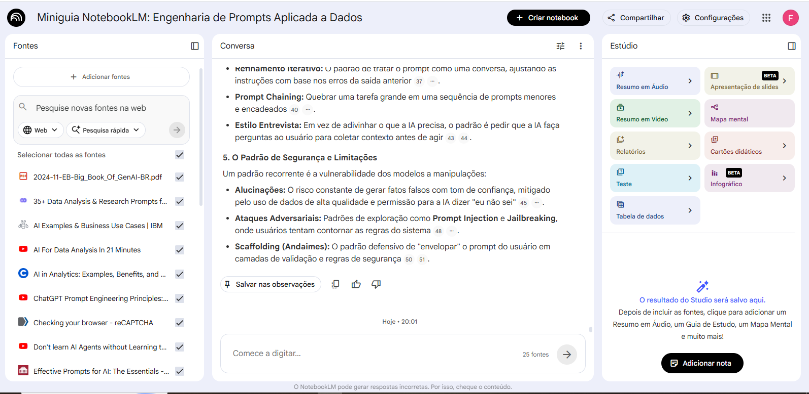
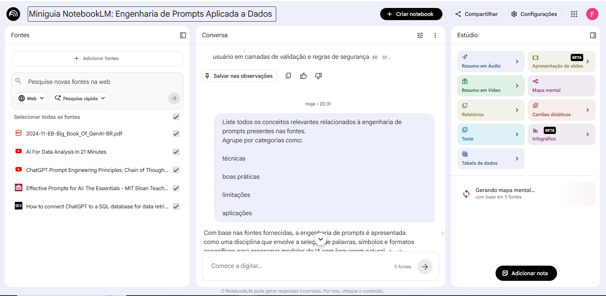
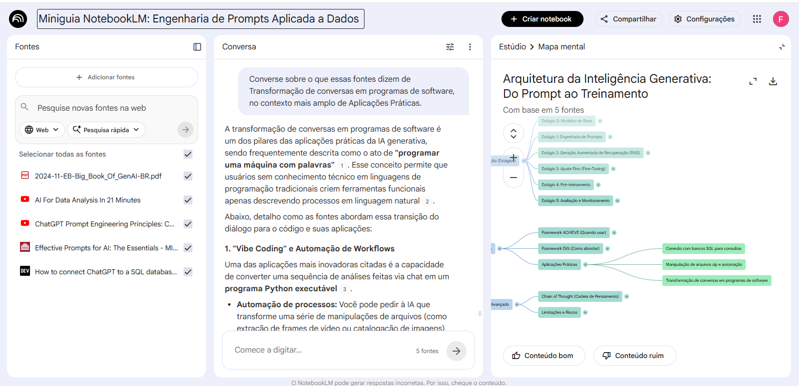

# 📘 Miniguia NotebookLM: Engenharia de Prompts Aplicada a Dados

## 🧠 Contexto

Este projeto explora o uso do NotebookLM como ferramenta de aprendizagem ativa, com foco em **Engenharia de Prompts aplicada à análise de dados e Business Intelligence (BI)**.

A proposta vai além da teoria: documenta o processo real de interação com IA, incluindo testes, falhas (“cicatrizes”) e refinamentos.

---

## 🎯 Objetivos

* Compreender os fundamentos da engenharia de prompts
* Identificar padrões eficazes na interação com LLMs
* Aplicar técnicas de prompting em cenários reais de análise de dados
* Desenvolver prompts reutilizáveis para contexto profissional (BI)
* Documentar o processo iterativo de aprendizado com IA

---

## 📚 Curadoria de Fontes

As fontes foram selecionadas com base em profundidade técnica, aplicabilidade prática e relevância para o mercado:

1. Big Book of GenAI (Databricks)
2. Effective Prompts for AI (MIT Sloan)
3. Chain of Thought Prompting (All About AI)
4. AI for Data Analysis (Tina Huang)
5. ChatGPT + SQL (DEV Community)

---

## ⚙️ Engenharia de Prompts e Cicatrizes

### 🔹 Prompt Inicial (Fraco)

```
Explique engenharia de prompts
```

**Problema:**

* Muito genérico
* Resposta superficial

---

### 🔹 Prompt Refinado

```
Explique engenharia de prompts com foco em aplicações práticas para análise de dados.
```

**Melhoria:**

* Mais direcionamento
* Resposta mais útil

---

### 🔹 Prompt Otimizado

```
Atue como um analista de dados sênior.
Explique engenharia de prompts com exemplos aplicados a SQL, dashboards e tomada de decisão.
```

**Resultado:**

* Alta relevância prática
* Resposta aplicável ao mercado

---

### 🔥 Cicatrizes (Aprendizados Reais)

* Prompts genéricos geram respostas genéricas
* Contexto é mais importante que complexidade
* A IA não “adivinha” intenção — precisa de instruções explícitas
* Iteração é obrigatória para qualidade
* Estrutura > texto livre

---

## 🧩 Principais Padrões Identificados

### 1. Prompt como Estrutura

Prompts eficazes seguem um padrão:

* Papel (persona)
* Tarefa
* Contexto
* Restrições
* Formato de saída

---

### 2. Raciocínio Estruturado

Técnicas como:

* Chain of Thought (CoT)
* Tree of Thoughts (ToT)

Melhoram significativamente a precisão ao forçar o modelo a explicitar o raciocínio.

---

### 3. Gestão de Contexto

* LLMs possuem limite de memória (tokens)
* Sofrem com o efeito *Lost in the Middle*
* RAG é essencial para dados atualizados

---

### 4. Processo Iterativo

Prompting funciona como um ciclo:

* criação
* teste
* ajuste
* refinamento

---

### 5. Limitações e Riscos

* Alucinações
* Respostas inconsistentes
* Dependência de contexto

---

## 🧾 Resumo Estruturado

A engenharia de prompts pode ser entendida como o processo de estruturar instruções para guiar modelos de linguagem a produzir respostas mais precisas, úteis e controláveis.

Ela combina:

* design de entrada (input)
* controle de contexto
* definição de formato de saída
* iteração contínua

---

## 📊 Caso Prático: Engenharia de Prompts em BI

### 🎯 Objetivo
Identificar os 5 produtos mais vendidos no último mês com base no volume total de vendas.

---

### 🧠 Prompt utilizado
```
Atue como um analista de dados.
Gere uma query SQL para identificar os 5 produtos mais vendidos no último mês, considerando volume total de vendas.
```

---

### 💻 Query gerada (SQL)

```sql
SELECT 
    p.ProductName,
    SUM(od.Quantity) AS TotalVolume
FROM Products p
JOIN OrderDetails od ON p.ProductID = od.ProductID
JOIN Orders o ON od.OrderID = o.OrderID
WHERE o.OrderDate >= DATE_SUB(CURRENT_DATE(), INTERVAL 1 MONTH)
GROUP BY p.ProductName
ORDER BY TotalVolume DESC
LIMIT 5;
```

---

### 📈 Explicação
- A query realiza JOIN entre produtos, pedidos e detalhes de pedidos 
- Utiliza SUM(Quantity) para calcular o volume total vendido 
- Filtra os dados para o último mês 
- Ordena os resultados e retorna o Top 5 

--- 

### 💡 Insight
A utilização de prompts estruturados permite transformar linguagem natural em consultas SQL complexas, reduzindo o tempo de análise e aumentando a produtividade no contexto de BI. 

--- 

### ⚠️ Considerações 
- Validar integridade dos dados (valores nulos ou inconsistentes) 
- Garantir indexação em OrderDate para performance 
- Ajustar granularidade caso existam múltiplos pedidos por produto

---

## 📘 Glossário

**LLM (Large Language Model):** modelo treinado em grandes volumes de texto

**Prompt:** instrução enviada para a IA

**Zero-shot:** sem exemplos

**Few-shot:** com exemplos

**Chain of Thought:** raciocínio passo a passo

**RAG:** uso de dados externos para melhorar respostas

**Tokens:** unidades de texto processadas pelo modelo

---

## ♻️ Prompts Reutilizáveis

```
1. Atue como um especialista em [área] e explique [tema] com exemplos práticos.

2. Explique este conceito aplicado ao contexto de análise de dados.

3. Gere um exemplo real utilizando SQL ou dashboard.

4. Liste erros comuns ao aplicar esse conceito.

5. Estruture a resposta em formato de tabela.

6. Explique passo a passo o raciocínio antes da resposta final.

7. Faça perguntas para entender melhor o contexto antes de responder.
```

---

## 💡 Insights Técnicos

* LLMs não raciocinam por padrão — precisam ser induzidos
* Contexto bem estruturado supera conhecimento prévio
* Prompt bom se comporta como código, não como conversa
* Iteração é parte essencial do processo
* IA é probabilística — não determinística

---

## 🚀 Conclusão

A engenharia de prompts não é apenas uma habilidade técnica, mas uma competência estratégica para profissionais de dados.

Ela permite transformar modelos de IA em ferramentas práticas para:

* análise de dados
* automação de tarefas
* geração de insights

## 📸 Exemplos no NotebookLM

### Upload das fontes




---

## 🔗 Entrega

Este repositório foi desenvolvido como parte de um desafio prático da DIO, com foco em aprendizagem ativa e construção de portfólio.
